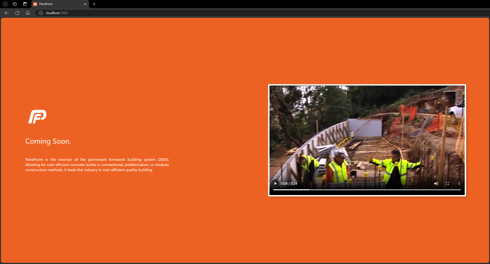

# PanelForm App

  

# A Dockerised React Client & Node.js/Express Server.

A working web application viewable on http://localhost:3000 after installing the neccessary dependancies and running <code>docker-compose up --build</code>

# About PanelForm

PanelForm is the inventor of the permenant formwork building system (2005). Allowing for cost-efficient concrete builds in conventional, prefabrication, or modular construction methods, it leads the industry in cost-efficient quality building.

The company's owner Paul Blazevic came out on top against Sydney Olympic Park/Stadium and won the 1999 Master Builder's Association Best Design & Build.

Featured on & winning ABC's New Inventor's program, PanelForm's popularity grew, resulting in the product being used across Australia, and other countries across the globe. 

Being the CSIRO tested & approved, it was eventually used to construct a home so large in a location deemed so difficult that PanelForm was featured on Grand Designs: Australia.

